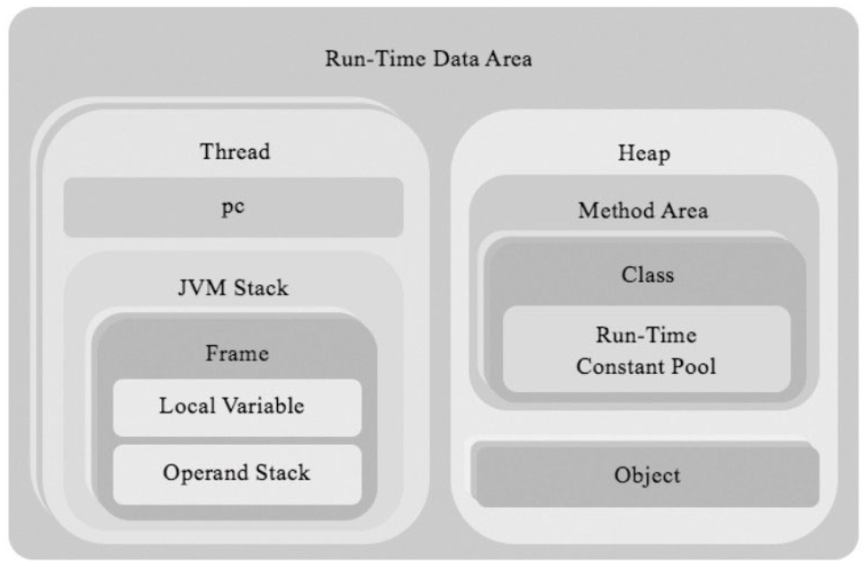

# jvm相关基本知识

## ch05

### 运行时数据区结构

### 常量指令说明
`iconst`, `bipush`, `sipush`, `ldc` 四条指令分别对应于不同范围的整数，`iconst`为 -1 ~ 5，`bipush` -127 ~ 128,
`sipush` -32768 ~ 32767，`ldc` -2147483648 ~ 2147483647

## ch11

### 疑问
- 多个 `frame` 之间要如何搭配起来工作，函数调用的时候的上下文切换在哪里完成？
- 多个线程的协作如何实现？
- class 和 frame 是怎样建立联系的？是怎样的关系？

### 本章内容

- 本章将进一步处理ClassFile结构体，把它加以转换，放进方法区以供后续使用。
- 初步讨论类和对象的设计，实现一个简单的类加载器，并且实现类和对象相关的部分指令。

- 关于多态的实现，在调用实例方法时，就已经将 this 一起传进去了，这个 this 指针指导就是实际调用方法的对象
   
   - 根据继承层级逐层向上找是哪个方法
   - 可以使用虚函数表 vtable 加速这个过程
   - 关于 this 是谁放进去的，考虑到这就是一组压栈操作，是一系列压栈指令，那就是 javac 编译器完成的这些事了 
  

## ch11
书中关于反射的探讨仅限于获取类对象，之后就戛然而止，很不尽兴。。